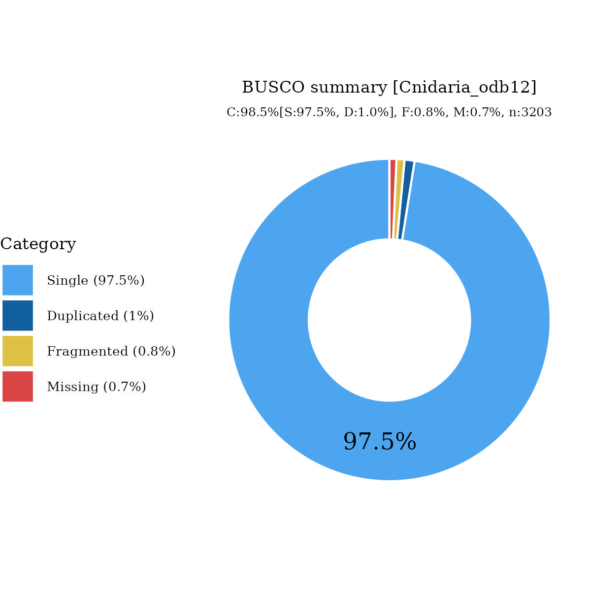

# Files for jaAcrSpat14

* braker.codingseq.gz - coding seqs from BRAKER3 predictions
* braker.aa.gz - proteins from BRAKER3 predictions
* braker.gtf.gz - GTF style annotation
* jaAcrSpat14.emapper.decorated.gff.gz - GFF style annotation with EggNOG-mapper decoration
* jaAcrSpat14.emapper.annotation.gz - EggNOG-mapper annotation output

# Files hosted elsewhere

* [softmasked genome FASTA](https://asg_hubs.cog.sanger.ac.uk/jaAcrSpat14/jaAcrSpat14.fa.masked)
* [tarball of RepeatModeller output](https://asg_hubs.cog.sanger.ac.uk/jaAcrSpat14/jaAcrSpat14.tar.xz)
* [BAM file](https://asg_hubs.cog.sanger.ac.uk/jaAcrSpat14/VARUS_modified.bam) of VARUS sampled RNASeq from SRA (max 30 million spots)

# Statistics:

---
 * genes: 28646
 * average_gene_length: 5843
 * transcripts_per_gene: 1.1563569084688963
 * average_transcript_length: 1402
 * exons_per_transcript: 6.657750943396226
 * average_exon_length: 210

# BUSCO

  

