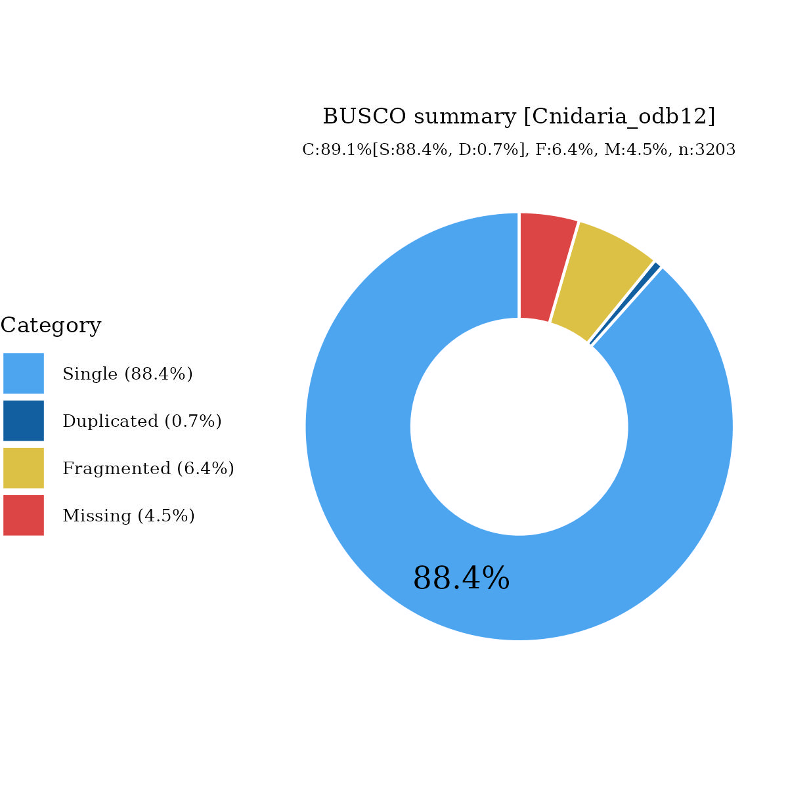

# Files for jaBlaWell11

* braker.codingseq.gz - coding seqs from BRAKER3 predictions
* braker.aa.gz - proteins from BRAKER3 predictions
* braker.gtf.gz - GTF style annotation
* jaBlaWell11.emapper.decorated.gff.gz - GFF style annotation with EggNOG-mapper decoration
* jaBlaWell11.emapper.annotation.gz - EggNOG-mapper annotation output

# Files hosted elsewhere

* [softmasked genome FASTA](https://asg_hubs.cog.sanger.ac.uk/jaBlaWell11/jaBlaWell11.fa.masked)
* [tarball of RepeatModeller output](https://asg_hubs.cog.sanger.ac.uk/jaBlaWell11/jaBlaWell11.tar.xz)

# Statistics:

---
 * genes: 32412
 * average_gene_length: 5276
 * transcripts_per_gene: 1.1090028384548933
 * average_transcript_length: 1373
 * exons_per_transcript: 5.883683405202393
 * average_exon_length: 233

# BUSCO

  

