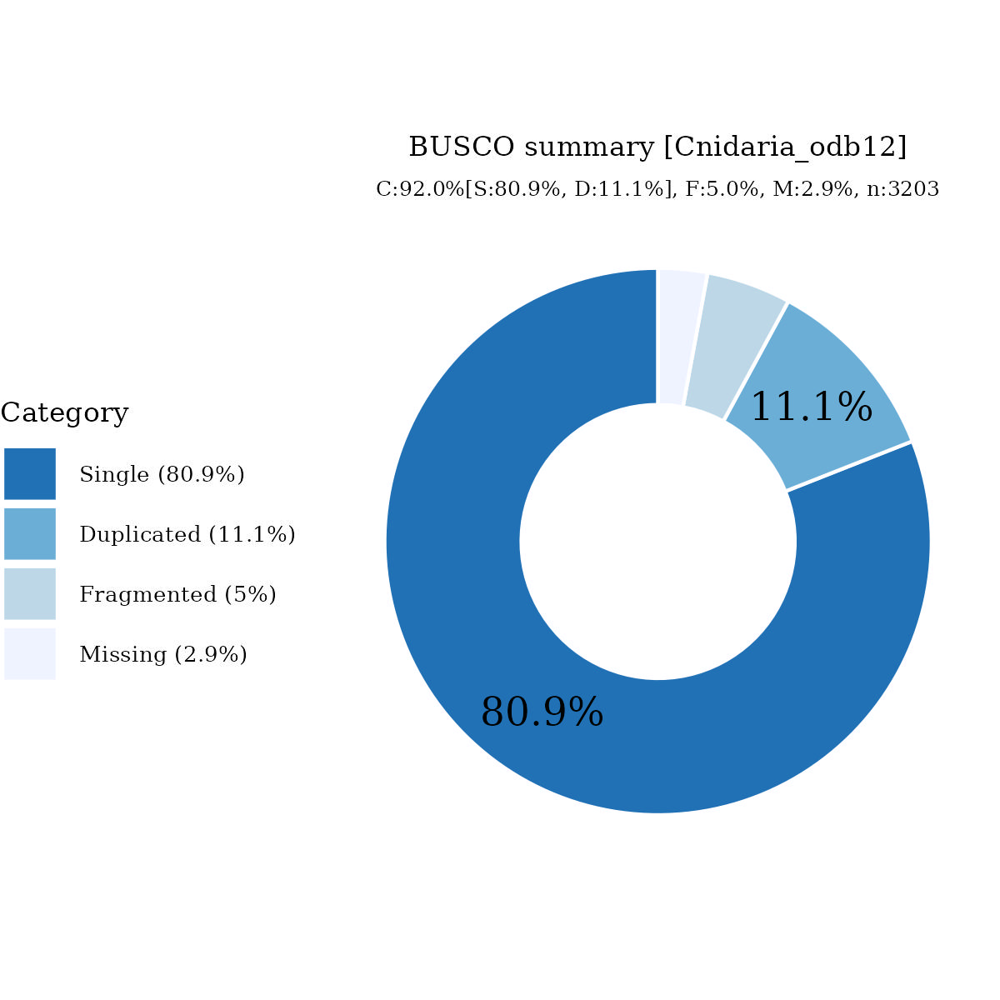

# Files for jaEchHorr1

* braker.codingseq.gz - coding seqs from BRAKER3 predictions
* braker.aa.gz - proteins from BRAKER3 predictions
* braker.gtf.gz - GTF style annotation
* jaEchHorr1.emapper.decorated.gff.gz - GFF style annotation with EggNOG-mapper decoration
* jaEchHorr1.emapper.annotation.gz - EggNOG-mapper annotation output

# Files hosted elsewhere

* [softmasked genome FASTA](https://asg_hubs.cog.sanger.ac.uk/jaEchHorr1/jaEchHorr1.fa.masked)
* [tarball of RepeatModeller output](https://asg_hubs.cog.sanger.ac.uk/jaEchHorr1/jaEchHorr1.tar.xz)
* [BAM file](https://asg_hubs.cog.sanger.ac.uk/jaEchHorr1/VARUS_modified.bam) of VARUS sampled RNASeq from SRA (max 30 million spots)

# Statistics:

---
 * genes: 50644
 * average_gene_length: 4613
 * transcripts_per_gene: 1.1529697496248321
 * average_transcript_length: 1245
 * exons_per_transcript: 5.330496138103475
 * average_exon_length: 233

# BUSCO

  

