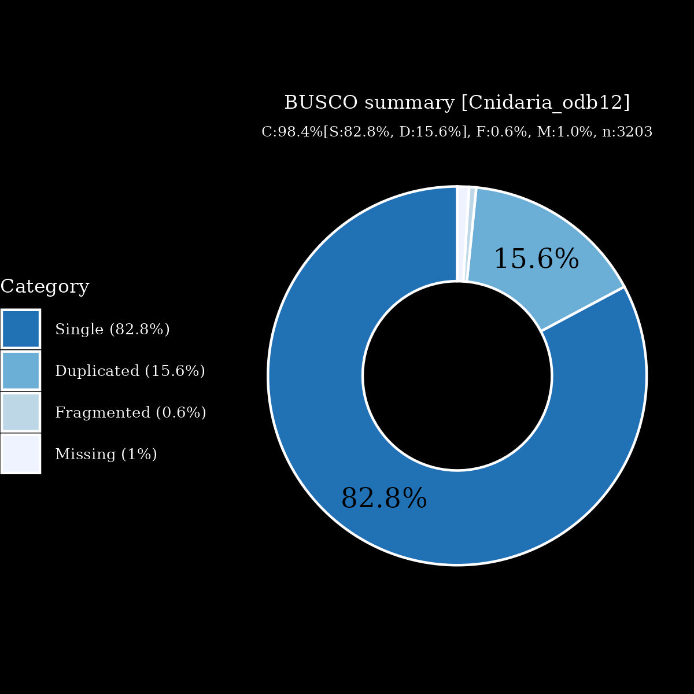

# files for jaMeaMean2

* braker.codingseq.gz - coding seqs from BRAKER3 predictions
* braker.aa.gz - proteins from BRAKER3 predictions
* braker.gtf.gz - GTF style annoations from BRAKER3
* jaMeaMean2.emapper.decorated.gff.gz - GFF style annoations with EggNOG-mappe decoration from BRAKER3
* jaMeaMean2.emapper.annotation.gz - Annotation output from EggNOG-mapper

# files hosted elsewhere
* [softmasked genome FASTA](https://asg_hubs.cog.sanger.ac.uk/jaMeaMean2/jaMeaMean2.fa.masked)
* [tarball of RepeatModeller output](https://asg_hubs.cog.sanger.ac.uk/jaMeaMean2/jaMeaMean2.tar.xz)
* [BAM file](https://asg_hubs.cog.sanger.ac.uk/jaMeaMean2/VARUS_modified.bam) of VARUS sampled RNASeq from SRA (max 30 million spots)

# Statistics:

---
 * genes: 32669
 * average_gene_length: 6262
 * transcripts_per_gene: 1.1568765496342097
 * average_transcript_length: 1409
 * exons_per_transcript: 6.315896703180399
 * average_exon_length: 223

  

