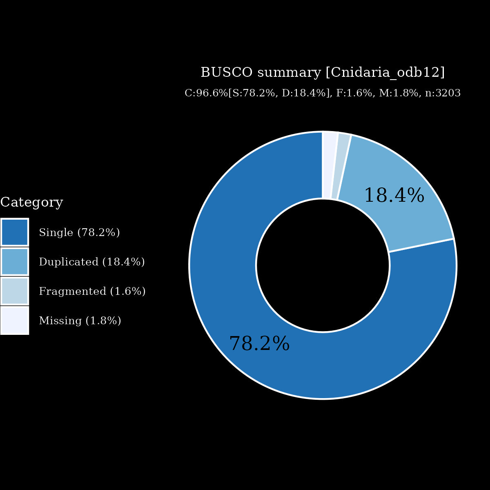

# files for jaMicLord3

* braker.codingseq.gz - coding seqs from BRAKER3 predictions
* braker.aa.gz - proteins from BRAKER3 predictions
* braker.gtf.gz - GTF style annoations from BRAKER3
* jaMicLord3.emapper.decorated.gff.gz - GFF style annoations with EggNOG-mappe decoration from BRAKER3
* jaMicLord3.emapper.annotation.gz - Annotation output from EggNOG-mapper

# files hosted elsewhere
* [softmasked genome FASTA](https://asg_hubs.cog.sanger.ac.uk/jaMicLord3/jaMicLord3.fa.masked)
* [tarball of RepeatModeller output](https://asg_hubs.cog.sanger.ac.uk/jaMicLord3/jaMicLord3.tar.xz)
* [BAM file](https://asg_hubs.cog.sanger.ac.uk/jaMicLord3/VARUS_modified.bam) of VARUS sampled RNASeq from SRA (max 30 million spots)

# Statistics:

---
 * genes: 34553
 * average_gene_length: 5762
 * transcripts_per_gene: 1.1668161954099499
 * average_transcript_length: 1279
 * exons_per_transcript: 5.767368603814768
 * average_exon_length: 221

  

