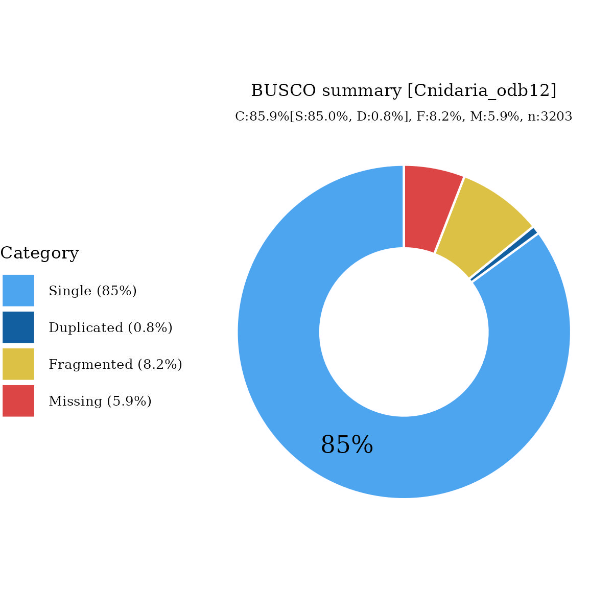

# Files for jaMonPala3

* braker.codingseq.gz - coding seqs from BRAKER3 predictions
* braker.aa.gz - proteins from BRAKER3 predictions
* braker.gtf.gz - GTF style annotation
* jaMonPala3.emapper.decorated.gff.gz - GFF style annotation with EggNOG-mapper decoration
* jaMonPala3.emapper.annotation.gz - EggNOG-mapper annotation output

# Files hosted elsewhere

* [softmasked genome FASTA](https://asg_hubs.cog.sanger.ac.uk/jaMonPala3/jaMonPala3.fa.masked)
* [tarball of RepeatModeller output](https://asg_hubs.cog.sanger.ac.uk/jaMonPala3/jaMonPala3.tar.xz)

# Statistics:

---
 * genes: 59386
 * average_gene_length: 4687
 * transcripts_per_gene: 1.1308725962348027
 * average_transcript_length: 1081
 * exons_per_transcript: 4.291119449656035
 * average_exon_length: 252

# BUSCO

  

