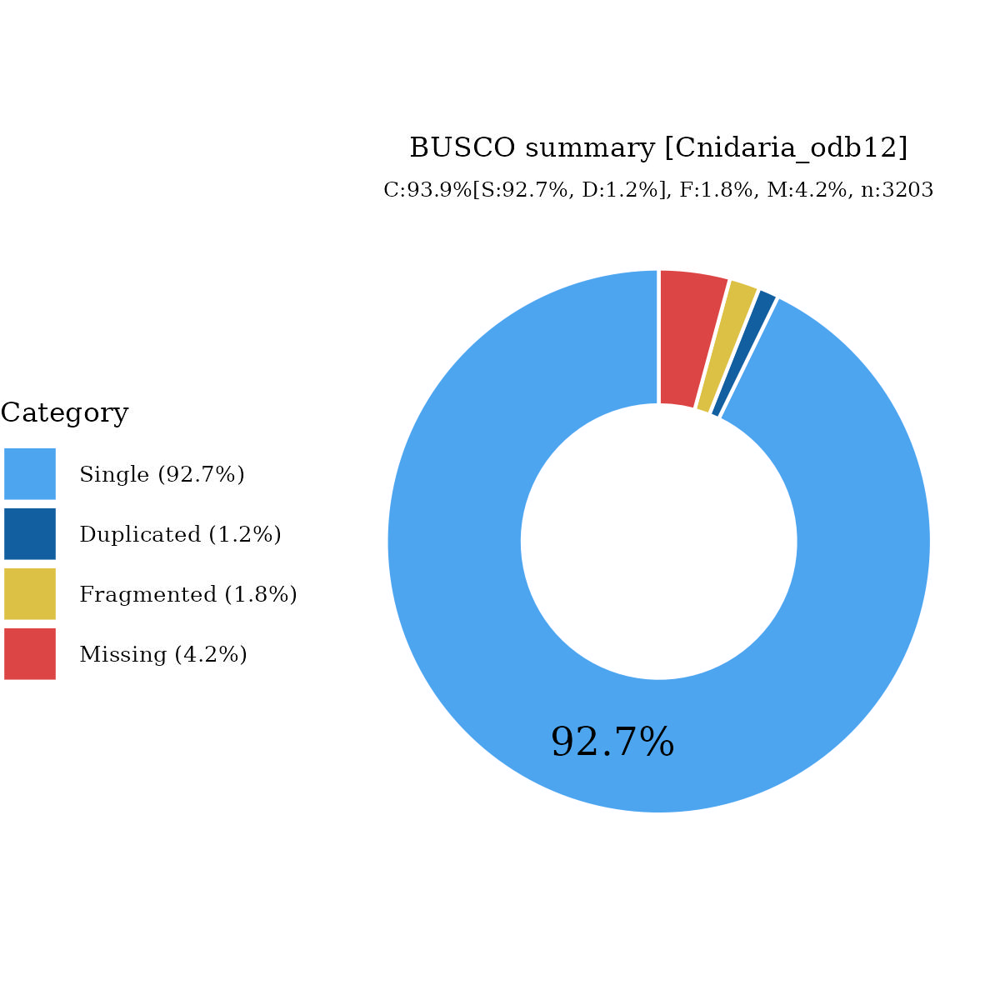

# Files for jaMonSpea1

* braker.codingseq.gz - coding seqs from BRAKER3 predictions
* braker.aa.gz - proteins from BRAKER3 predictions
* braker.gtf.gz - GTF style annotation
* jaMonSpea1.emapper.decorated.gff.gz - GFF style annotation with EggNOG-mapper decoration
* jaMonSpea1.emapper.annotation.gz - EggNOG-mapper annotation output

# Files hosted elsewhere

* [softmasked genome FASTA](https://asg_hubs.cog.sanger.ac.uk/jaMonSpea1/jaMonSpea1.fa.masked)
* [tarball of RepeatModeller output](https://asg_hubs.cog.sanger.ac.uk/jaMonSpea1/jaMonSpea1.tar.xz)

## Note:

* BRAKER3 RNA fed using [ERR13493968](https://www.ebi.ac.uk/ena/browser/view/ERR13493968)

# Statistics:

---
 * genes: 37095
 * average_gene_length: 6472
 * transcripts_per_gene: 1.1307723412858877
 * average_transcript_length: 1171
 * exons_per_transcript: 5.07323701902446
 * average_exon_length: 230

# BUSCO

  

