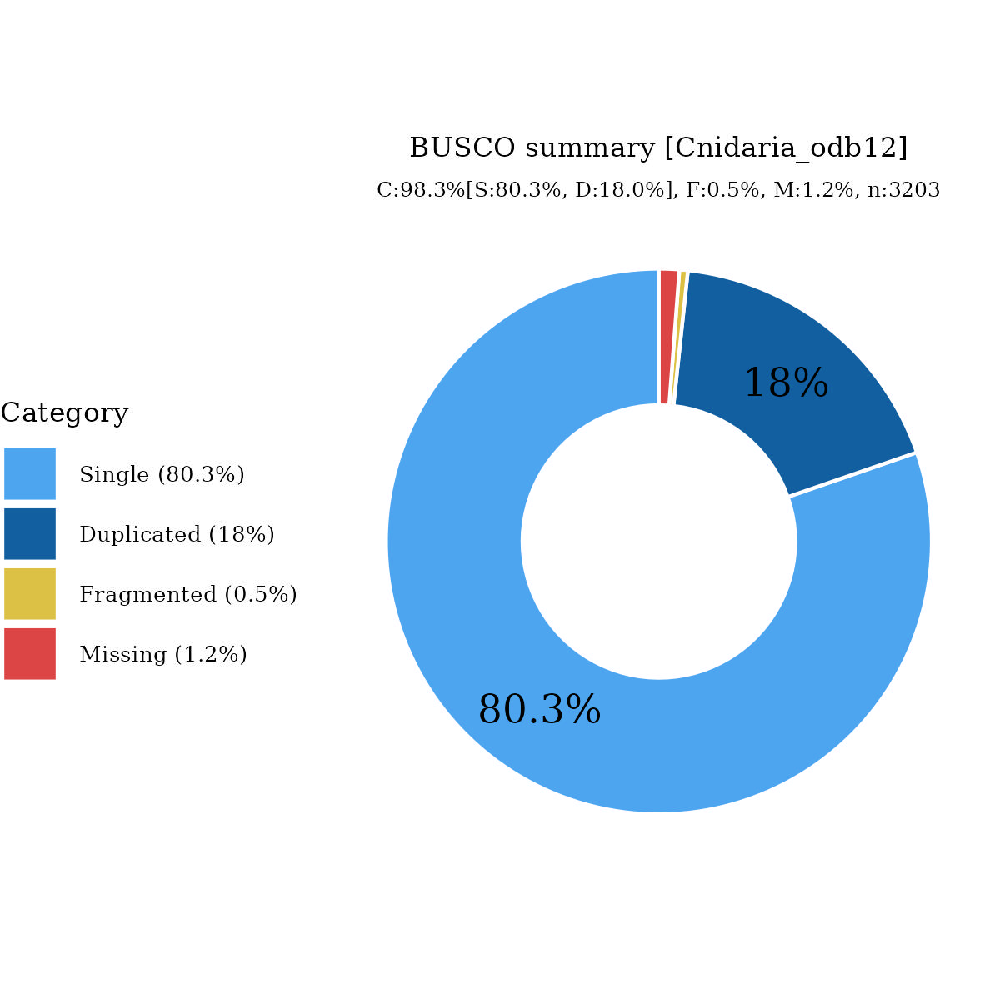

# Files for jaPorLute2

* braker.codingseq.gz - coding seqs from BRAKER3 predictions
* braker.aa.gz - proteins from BRAKER3 predictions
* braker.gtf.gz - GTF style annotation
* jaPorLute2.emapper.decorated.gff.gz - GFF style annotation with EggNOG-mapper decoration
* jaPorLute2.emapper.annotation.gz - EggNOG-mapper annotation output

# Files hosted elsewhere

* [softmasked genome FASTA](https://asg_hubs.cog.sanger.ac.uk/jaPorLute2/jaPorLute2.fa.masked)
* [tarball of RepeatModeller output](https://asg_hubs.cog.sanger.ac.uk/jaPorLute2/jaPorLute2.tar.xz)
* [BAM file](https://asg_hubs.cog.sanger.ac.uk/jaPorLute2/VARUS_modified.bam) of VARUS sampled RNASeq from SRA (max 30 million spots)

# Statistics:

---
 * genes: 29172
 * average_gene_length: 6683
 * transcripts_per_gene: 1.1445221445221445
 * average_transcript_length: 1415
 * exons_per_transcript: 6.419701689229663
 * average_exon_length: 220

# BUSCO

  

