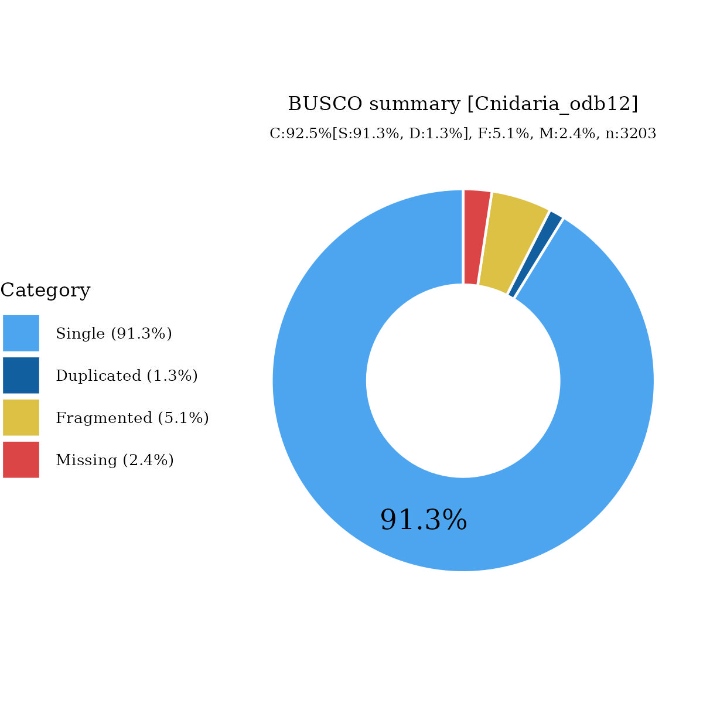

# Files for jaSteInte3

* braker.codingseq.gz - coding seqs from BRAKER3 predictions
* braker.aa.gz - proteins from BRAKER3 predictions
* braker.gtf.gz - GTF style annotation
* jaSteInte3.emapper.decorated.gff.gz - GFF style annotation with EggNOG-mapper decoration
* jaSteInte3.emapper.annotation.gz - EggNOG-mapper annotation output

# Files hosted elsewhere

* [softmasked genome FASTA](https://asg_hubs.cog.sanger.ac.uk/jaSteInte3/jaSteInte3.fa.masked)
* [tarball of RepeatModeller output](https://asg_hubs.cog.sanger.ac.uk/jaSteInte3/jaSteInte3.tar.xz)

# Statistics:

---
 * genes: 41409
 * average_gene_length: 6218
 * transcripts_per_gene: 1.1155062909029438
 * average_transcript_length: 1298
 * exons_per_transcript: 5.517080879806027
 * average_exon_length: 235

# BUSCO

  

