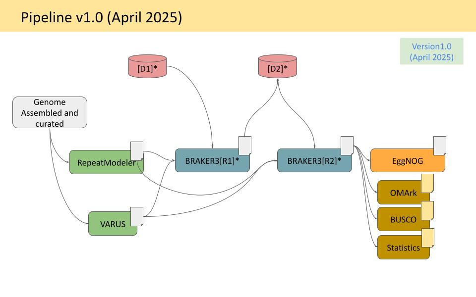

## Scleractinia genome annotation pipeline - V2

## What changed in v2.0
 
| | v1.0 | v2.0 |
|---|---|---|
| Genomes | 40 | 95 |
| Gene prediction | BRAKER3 (single pass) | BRAKER3 (two-pass) |
| Protein database | Scleractinia (D1) + Clade specific (D2) | OrthoDB Cnidaria + Scleractinia predicted v1 (D1) + Scleractinia v2 (D2) |
| RNA-seq | VARUS (when available) | VARUS (when available); protein-only mode otherwise |
| BUSCO lineage | cnidaria_odb12 | cnidaria_odb12 |
| Annotation QC | BUSCO + OMARK | BUSCO + OMARK |
| Functional annotation | EggNOG-mapper | EggNOG-mapper + InterProScan |
| Assembly stats | — | QUAST + seqkit |

---

  

#### NOTE:

* [R1]: Round 1 gene prediction with BRAKER3
* [R2]: Round 2 gene prediction with BRAKER3: Group specific (Complex/Robust)
* [D1]: Scleractinia protein dataset (over 1.2 million proteins) | v2 - OrthoDB Cnidaria + Scleractinia predicted v1
* [D2]: Complex/Robust protein dataset | v2 - Scleractinia predicted in V1

